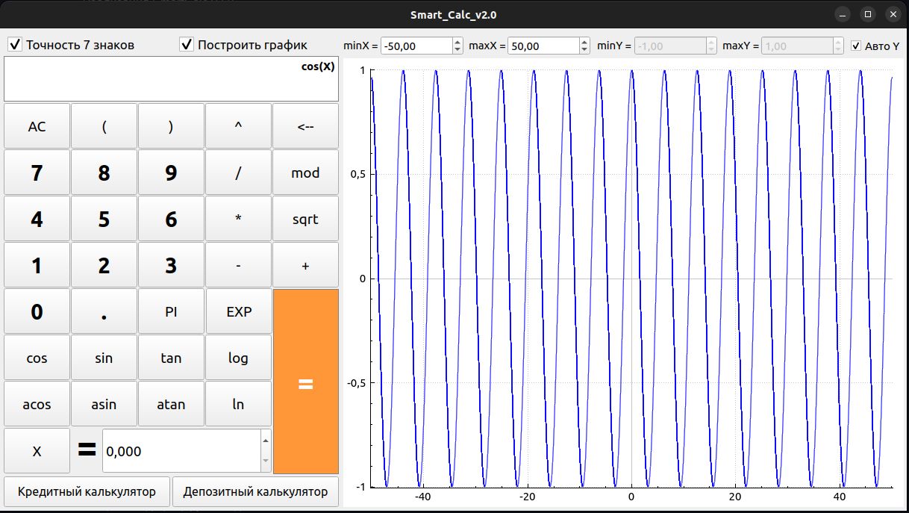
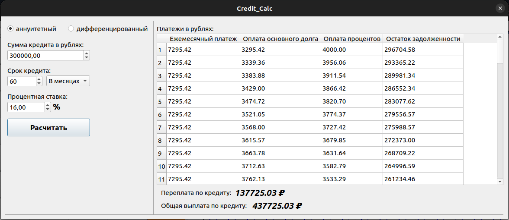

# SmartCalc-v2
Реализация SmartCalc v2.0.

### Паттерн MVC
Паттерн MVC (Model-View-Controller, Модель-Представление-Контроллер) представляет из себя схему разделения модулей приложения на три отдельных макрокомпонента: модель, содержащую в себе бизнес-логику, представление (форму пользовательского интерфейса для осуществления взаимодействия с программой) и контроллер, осуществляющий модификацию модели по действию пользователя.
Концепция MVC была описана Трюгве Реенскаугом в 1978 году, работавшем в научно-исследовательском центре «Xerox PARC» над языком программирования «Smalltalk». Позже, Стив Бурбек реализовал шаблон в Smalltalk-80. Окончательная версия концепции MVC была опубликована лишь в 1988 году в журнале Technology Object. Впоследствии шаблон проектирования стал эволюционировать. Например, была представлена иерархическая версия HMVC, MVA, MVVM. 

Модель хранит и осуществляет доступ к основным данным, производит по запросам операции, определенные бизнес-логикой программы, то есть отвечает за ту часть программы, которая ответственна за все алгоритмы и процессы обработки информации. Данные модели, изменяясь под действием контроллера, влияют на отображение информации на представлении пользовательского интерфейса. В качестве модели в данной программе должна выступить библиотека классов, осуществляющая вычисления калькулятора. Эта библиотека должна предоставлять все необходимые классы и методы для осуществления подсчетов. Это и есть бизнес-логика данной программы, так как предоставляет средства для решения задачи. 

Контроллер - тонкий макрокомпонент, который осуществляет модификацию модели. Через него формируются запросы на изменение модели. В коде он выглядит как некий «фасад» для модели, то есть набор методов, которые уже работают напрямую с ней. Тонким он называется потому, что идеальный контроллер не содержит в себе никакой дополнительной логики, кроме вызова одного или нескольких методов модели. Контроллер выполняет функцию связующего элемента между интерфейсом и моделью. Это позволяет полностью инкапсулировать модель от отображения. Такое разделение полезно в силу того, что позволяет коду представления ничего не знать о коде модели и обращаться к одному лишь контроллеру, интерфейс предоставляемых функций которого, вероятно, не будет значительно меняться. Модель же может претерпевать значительные изменения, и, при «переезде» на другие алгоритмы, технологии или даже языки программирования в модели, потребуется поменять лишь небольшой участок кода в контроллере, непосредственно связанный с моделью. Иначе, вероятнее всего, пришлось бы переписывать значительную часть кода интерфейса, так как он бы сильно зависел от реализации модели. Таким образом, взаимодействуя с интерфейсом, пользователь вызывает методы контроллера, которые модифицируют модель.

К представлению относится весь код, связанный с интерфейсом программы. В коде идеального интерфейса не должно быть никакой бизнес-логики. Он только представляет форму для взаимодействия с пользователем.

## Part 1. Реализация SmartCalc v2.0

Тебе необходимо реализовать SmartCalc v2.0:

- Программа должна быть разработана на языке C++ стандарта C++17;
- Код программы должен находиться в папке src;
- При написании кода необходимо придерживаться Google Style;
- Классы должны быть реализованы внутри пространства имен `s21`;
- Необходимо подготовить полное покрытие unit-тестами модулей, связанных с вычислением выражений, c помощью библиотеки GTest;
- Сборка программы должна быть настроена с помощью Makefile со стандартным набором целей для GNU-программ: all, install, uninstall, clean, dvi, dist, tests. Установка должна вестись в любой другой произвольный каталог;
- Реализация с графическим пользовательским интерфейсом, на базе любой GUI-библиотеки с API для C++17: 
  * Для Linux: GTK+, CEF, Qt, JUCE;
  * Для Mac: GTK+, CEF, Qt, JUCE, SFML, Nanogui, Nngui;
- Программа должна быть реализована с использованием паттерна MVC, а также:
    - не должно быть кода бизнес-логики в коде представлений;
    - не должно быть кода интерфейса в контроллере и в модели;
    - контроллеры должны быть тонкими;
- На вход программы могут подаваться как целые числа, так и вещественные числа, записанные и через точку, и в экспоненциальной форме записи;
- Вычисление должно производиться после полного ввода вычисляемого выражения и нажатия на символ `=`;
- Вычисление произвольных скобочных арифметических выражений в инфиксной нотации;
- Вычисление произвольных скобочных арифметических выражений в инфиксной нотации с подстановкой значения переменной _x_ в виде числа;
- Построение графика функции, заданной с помощью выражения в инфиксной нотации с переменной _x_  (с координатными осями, отметкой используемого масштаба и сеткой с адаптивным шагом);
    - Не требуется предоставлять пользователю возможность менять масштаб;
- Область определения и область значения функций ограничиваются по крайней мере числами от -1000000 до 1000000;
    - Для построения графиков функции необходимо дополнительно указывать отображаемые область определения и область значения;
- Проверяемая точность дробной части - минимум 7 знаков после запятой;
- У пользователя должна быть возможность ввода до 255 символов;
- Скобочные арифметические выражения в инфиксной нотации должны поддерживать следующие арифметические операции и математические функции:
    - **Арифметические операторы**:

        | Название оператора | Инфиксная нотация   (Классическая) | Префиксная нотация   (Польская нотация) |  Постфиксная нотация   (Обратная польская нотация) |
        | ------ | ------ | ------ | ------ |
        | Скобки | (a + b) | (+ a b) | a b + |
        | Сложение | a + b | + a b | a b + |
        | Вычитание | a - b | - a b | a b - |
        | Умножение | a * b | * a b | a b * |
        | Деление | a / b | / a b | a b \ |
        | Возведение в степень | a ^ b | ^ a b | a b ^ |
        | Остаток от деления | a mod b | mod a b | a b mod |
        | Унарный плюс | +a | +a | a+ |
        | Унарный минус | -a | -a | a- |

        >Обрати внимание, что оператор умножения содержит обязательный знак `*`. Обработка выражения с опущенным знаком `*` является необязательной и остается на усмотрение разработчика.

    - **Функции**:
  
        | Описание функции | Функция |   
        | ---------------- | ------- |  
        | Вычисляет косинус | cos(x) |   
        | Вычисляет синус | sin(x) |  
        | Вычисляет тангенс | tan(x) |  
        | Вычисляет арккосинус | acos(x) | 
        | Вычисляет арксинус | asin(x) | 
        | Вычисляет арктангенс | atan(x) |
        | Вычисляет квадратный корень | sqrt(x) |
        | Вычисляет натуральный логарифм | ln(x) | 
        | Вычисляет десятичный логарифм | log(x) |

## Part 2. Дополнительно. Кредитный калькулятор

Предусмотри специальный режим «кредитный калькулятор» (за образец можно взять сайты banki.ru и calcus.ru):
 - Вход: общая сумма кредита, срок, процентная ставка, тип (аннуитетный, дифференцированный);
 - Выход: ежемесячный платеж, переплата по кредиту, общая выплата.

## Part 3. Дополнительно. Депозитный калькулятор

Предусмотри специальный режим «калькулятор доходности вкладов» (за образец можно взять сайты banki.ru и calcus.ru):
 - Вход: сумма вклада, срок размещения, процентная ставка, налоговая ставка, периодичность выплат, капитализация процентов, список пополнений, список частичных снятий;
 - Выход: начисленные проценты, сумма налога, сумма на вкладе к концу срока.

## Сборка и запуск

Программа разрабатывались и тестировались в ОС **`Ubuntu desktop 22.04`** на С/С++ (+QT)

- `make check` - проверка стилей и cppcheck
- `make tests` - запуск тестов
- `make leak_test` - проверка на утечки памяти
- `make gcov_report` - запуск тестов и генерация отчета. `make open_report` - открывает отчет
- `make clean` - удалить файлы сборки и временные файлы
- `make install` -  собрать приложение. Автоматически откроется каталог `/home/SmartCalc-2.0` в нем будет находиться исполняемый файл программы `s21_smart_calc_v2.0`
- `make uninstall` -  удаляет приложение из `/home/SmartCalc-2.0`

